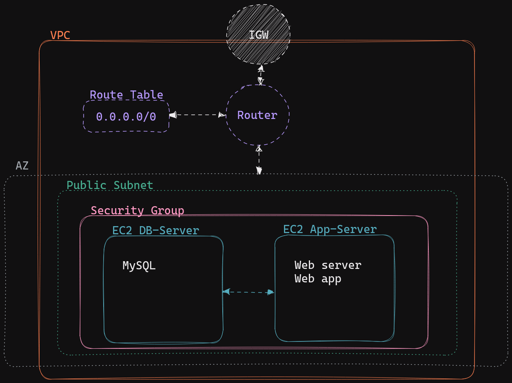

# 4640 W23 Exam Ansible Section Start Files

## Instructions

### Before starting

Create a new ssh key. 
Add the path to this key in the Terraform `main.tf` file as well as the Ansible `ansible.cfg` file.

After adding the path to your new key, setup your infrastructure with the provided Terraform configuration. This will create the infrastructure in the included diagram.

### Setting up Bookstack with Ansible

To start you have a mostly complete database role. Use this as an example to help you create a bookstack role

### Adding tags

Add the following tags to the bookstack tasks file
- git
- bookstack
- apache

Only add the tags to appropriate tasks, some tasks might have more than one tag.

#### To Complete database role

- Complete the "Create bookstack user" task in `roles/database/tasks/main.yml`

#### To Complete bookstack role 

- Add the bookstack role to the `site.yml` playbook.
- Complete the directory structure for the role. All of the files you need for this have been provided. Some of these files are incomplete.
  - Some directories and files will need to be moved, and renamed. 
- Add your servers IP address to the `bookstack defaults/main.yml` file.
- Complete the `bookstack tasks/main.yml` file.
  - There are comments in the file to help you.
  - Use the [bookstack installation script](https://github.com/BookStackApp/devops/blob/main/scripts/installation-ubuntu-22.04.sh) to help you complete the tasks in this file.
  - The partially complete bookstack installation uses apache2

### Grading

- Setup 2 points
  - Adding ssh key To Ansible and Terraform configuration files
  - Creating bookstack role directory structure
  - Editing bookstack defaults file
- Complete database task 1 point
- Complete site.yml, adding bookstack role 1 point
- Complete bookstack tasks:
  - Clone the bookstack repository. 1 point
  - Install the bookstack dependencies with Composer. 1 point
  - Create .env file from template. 1 point
  - Enable apache modules. 1 point
  - Create apache config file from template. 1 point
  - Restart apache service. 1 point
- Add tags to bookstack task file 1 point
- Code is clean, complete, properly indented... 1 point
- **Total** 12 points (weighted as 24 in the exam)

## Submission Instructions
Submit a zipped copy of the completed ansible directory: `q04.zip`
Make sure to include the `ansible-exam.log` file.
